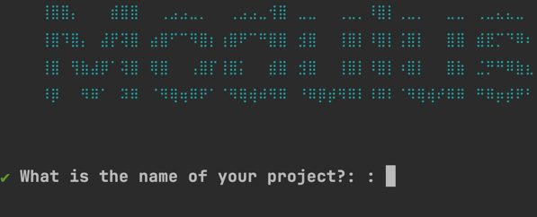
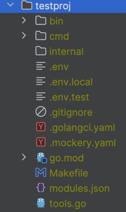
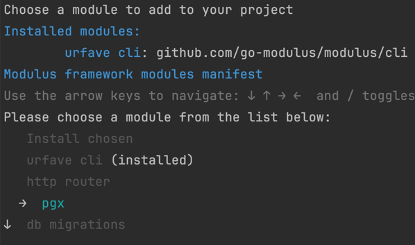

# Modulus

It is a framework to build modular server applications. It is designed to be simple and easy to use.
This project tends to answer the common developer questions:
- How to build a modular monolithic server application?
- How to decompose a codebase into modules to avoid increasing the code complexity?
- How to build a server application that can be easily extended and maintained?
- How to build a server application that can be easily tested?
- How to build a server application that can be easily deployed?

The first version of the project allows developers to create only two types of applications: cli app, and GraphQL web server. 

In both cases, the application is composed of modules. 
Each module is a directory that contains the module's code and configuration. 
The module's code is divided to packages. The structure of packages can be different, but we recommend to use the following structure:
- `graphql` - contains the module's GraphQL resolvers, schemas and other GraphQL related code (for example directives). We recommend to use https://gqlgen.com/ implementation of GraphQL library, and all our standard modules and approaches in working with GraphQL are based on this library.
- `storage` - contains the module's storage code (for example database models, DAO objects, etc.). We recommend to use https://sqlc.dev/ library for working with DB.
  - `migration` - a list of SQL migrations that should be applied to the database. We recommend to use https://github.com/amacneil/dbmate tool for managing migrations.
  - `queries` - a set of files with SQL queries that are used in the module and which will be compiled to the Golang code by SQLc.
  - `fixture` -  a set of generated fixtures to fill the database with test data.
  - `dataloader` - a set of generated dataloaders aimed to prevent N+1 problem in GraphQL queries. We recommend to use https://github.com/graph-gophers/dataloader library.
- `cli` - contains the module's CLI commands.
- `action` - contains the module's business logic divided to separate structures with only one public method `Exec(ctx, request)`. Each action changes the state of the application and returns changed data. 


## Installation
1. Install the Modulus CLI tool
```bash
go install github.com/go-modulus/modulus/cmd/mtools@latest
```
2. Init a project
```bash
mtools init 
```
3. It asks a name of your project.

4. Enter, for example, `testproj` and agree with the folder name.
5. The project is initialized with the following structure


* `bin` - contains the compiled binaries of the project.
* `cmd` - contains the entry points of the project. For example, `console` is the entry point for the CLI application.
* `internal` - the code of the project is placed here.
* `.env` - the default environment variables file.
* `.env.local` - the local overrides of environment variables file. It is used if the APP_ENV environment variable is not set. Otherwise, the file `.env.<APP_ENV>` is used to override variables from the `.env` file. This file is not committed to the repository.
* `.env.test` - the overrides of environment variables that are applied in tests.
* `.env.dev` - there is no such a file in the folder but you can create it if you need to override the environment variables for the development server. Run your server with the following command `APP_ENV=dev go run cmd/server/main.go` to use this file to override some variables in the .env file. The higher priority of overriding is set to the real OS env variables. So, on servers you are free to pass secrets via env variables avoiding storing them in the `.env.<APP_ENV>` file.
* `Makefile` - all service commands which can help you to develop your project. For example, run, test, analyze, etc. Each module can add own commands to this file.
* `modules.json` -  a manifest with installed modules of the Modulus framework

6. Install the modules
```bash
cd testproj
mtools module install
```
Select all modules you want to install. For example, select `pgx` module.

After that select the item "Install chosen".

It updates:
* the `modules.json` file with the installed modules.
```json
{
  "modules": [
    {
      "name": "pgx",
      "version": "v0.0.1"
    }
  ]
}
```
* the `go.mod` file with the dependencies of the installed modules.
* adds all environment variables that are required by the installed modules to the `.env` file.
* inits a module in the entrypoint of the project. For example, in the `cmd/console/main.go` file.
```go
importedModulesOptions := []fx.Option{
		...
		pgx.NewModule().BuildFx(),
	}
```

