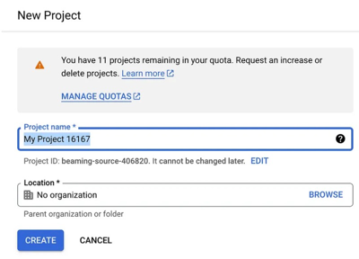
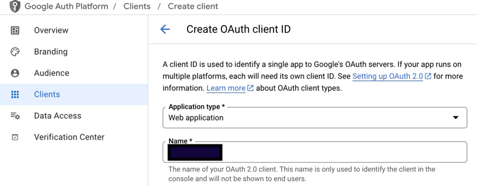

# Authenticate with Google

## Register a Google account

1. Go to the [Google Cloud Console](https://console.cloud.google.com/).
2. Create a new project.
   
3. Go to the "APIs & Services" -> "Credentials" section.
4. Click the "Create credentials" -> "OAuth client ID".
5. Choose "Web application" as the application type.
   
6. Add the authorized redirect URIs. For the local environment, it should be
   `http://localhost:8001/auth/google/callback`.
7. Copy the client ID and secret to the `.env` file.

```dotenv
   AUTH_GOOGLE_CLIENT_ID=...apps.googleusercontent.com
   AUTH_GOOGLE_SECRET=
```

8. Encode the client secret with the dotenvx CLI tool to the `.env.dev`.

```shell
dotenvx set AUTH_GOOGLE_SECRET "GOCSPX..." -f .env.dev
```

9. In the Google Cloud Console go to the "API & Services" -> "OAuth consent screen" -> "Audience" and add the email
   address.
10. On your frontend part create a route `/auth/google` that generates the secret and asks Google for authentication:

```js
    function generateCodeVerifier(length = 128) {
    const charset = 'ABCDEFGHIJKLMNOPQRSTUVWXYZabcdefghijklmnopqrstuvwxyz0123456789-._~';
    let result = '';
    for (let i = 0; i < length; i++) {
        result += charset.charAt(Math.floor(Math.random() * charset.length));
    }
    return result;
}

async function generateCodeChallenge(codeVerifier) {
    const data = new TextEncoder().encode(codeVerifier);
    const digest = await crypto.subtle.digest('SHA-256', data);
    return btoa(String.fromCharCode(...new Uint8Array(digest)))
        .replace(/\+/g, '-').replace(/\//g, '_').replace(/=+$/, '');
}

const getCodeBtn = document.getElementById('get-code-btn');
getCodeBtn.addEventListener('click', async () => {
    const codeVerifier = generateCodeVerifier();
    const codeChallenge = await generateCodeChallenge(codeVerifier);

    localStorage.setItem("code_verifier", codeVerifier);

    const params = new URLSearchParams({
        client_id: '{{ClientID}}',
        redirect_uri: '{{FrontedHost}}/auth/google/callback',
        response_type: 'code',
        scope: 'openid profile email',
        code_challenge: codeChallenge,
        code_challenge_method: 'S256',
    });

    window.location = `https://accounts.google.com/o/oauth2/v2/auth?${params.toString()}`;
});
```

11. Create a callback route `/auth/google/callback` that will handle the response from Google and send gained code to
    backend:

```js
const code = params.get('code');
const verifier = localStorage.getItem("code_verifier");

async function getAccessToken(code) {

    const response = await fetch('{{BackendHost}}/graphql', {
        method: 'POST',
        headers: {
            'Content-Type': 'application/json',
            'Accept': 'application/json',
        },
        body: JSON.stringify({
            query: `mutation {
        registerViaGoogle(input: {code: "${code}", verifier: "${verifier}"}) {
          accessToken
        }
      }`,
            variables: {}
        })
    });

    const result = await response.json();

    if (result.data && result.data.registerViaGoogle) {
        return result.data.registerViaGoogle.accessToken;
    } else {
        throw Error('Failed to retrieve access token: ' + JSON.stringify(result.errors || result));
    }
}
```

12. Use access token to gain access to the guarded queries and mutation.

Examples of the token exchange you can find in the [DEMO](https://backend.dev.i10x.ai/auth/google).

**Query:**

```graphql
mutation {
    registerViaGoogle(input: {
        code: "4/0AY0e-g7",
        verifier: "v3r1f13r"
    }) {
        accessToken
    }
}
```

**Errors:**

| Code                                        | Message                                                                                                                                                                                                                                                                                                                                                                                                                                                                 |
|---------------------------------------------|-------------------------------------------------------------------------------------------------------------------------------------------------------------------------------------------------------------------------------------------------------------------------------------------------------------------------------------------------------------------------------------------------------------------------------------------------------------------------|
| failed&nbsp;to&nbsp;get&nbsp;user&nbsp;info | There is an issue to get user info from Google. Please try again later                                                                                                                                                                                                                                                                                                                                                                                                  |
| failed to exchange token                    | There is an issue to exchange the token. Please try again later                                                                                                                                                                                                                                                                                                                                                                                                         |
| user already exists                         | **Note:** this error is only appears if the email is not verified in Google. <br>**Please log in using another type of authentication. You have registered using <another login type>.** <br> _If the user with such email is already registered_<br> **Your email of the Google account is not verified. Please verify your email first and try again.** <br> _If we have some data inconsistency when the user is created but there are no auth account have created_ |
| invalid identity                            | The Google registration is broken. We cannot authenticate you at the moment. Please try again later or use another type of registration.                                                                                                                                                                                                                                                                                                                                |
| account is blocked                          | Your account is blocked. Please contact support.                                                                                                                                                                                                                                                                                                                                                                                                                        |
